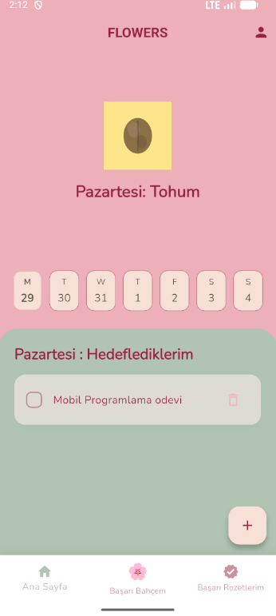
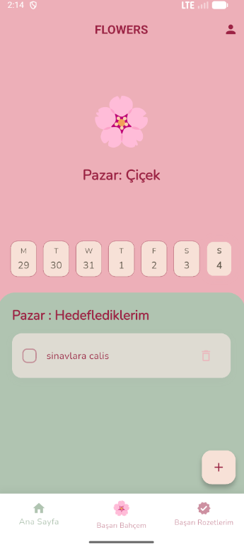
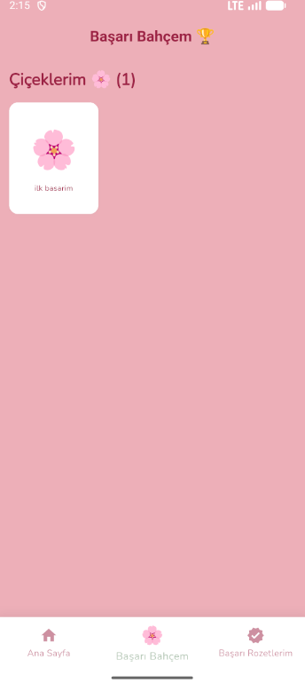
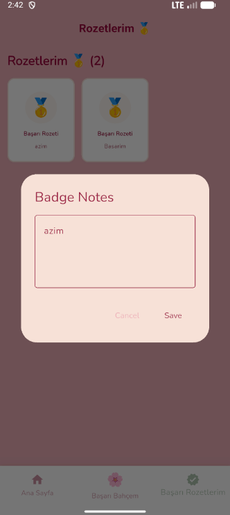

# Flowers App 🌸

Bu proje, kullanıcıların günlük hedeflerini takip etmelerini ve hedeflerine ulaştıkça sanal bir bahçe büyütmelerini sağlayan, oyunlaştırılmış bir hedef takip uygulamasıdır. Flutter kullanılarak geliştirilmiş ve backend servisi olarak Supabase entegre edilmiştir.

## 🚀 Özellikler

*   **📝 Hedef Takibi:** Günlük hedeflerinizi belirleyin ve ilerlemenizi kaydedin.
*   **🌱🌸 Sanal Bahçe:** Hedeflerinizi tamamladıkça bitkinizi büyütün. Başarılı haftaların sonunda tamamen büyüyen çiçeğinizi "Başarı Bahçesi"ne ekleyin.
*   **🥇 Rozet Sistemi:** Hedeflerinizi tamamlamadığınız günden sonraki günlerde düzenli ve azimli çalışmalarınız karşılığında başarı rozetlerini kazanın.
*   **🔐 Kullanıcı Yönetimi:** Supabase destekli güvenli giriş ve kayıt işlemleri.

## 🛠️ Teknolojiler

*   **Framework:** Flutter
*   **Backend:** Supabase
*   **State Management:** Flutter Bloc
*   **Font:** Google Fonts

## 📸 Ekran Görüntüleri

| Giriş Ekranı | Ana Sayfa (Tohum) Pazartesi Günü| Ana Sayfa (Çiçek) Pazar Günü|
| :---: | :---: | :---: |
|  |  |  |

| Bağış Linki | Başarı Bahçesi |
| :---: | :---: |
|  |  |

| Rozet Detayı | Profil |
| :---: | :---: |
|  |  |
